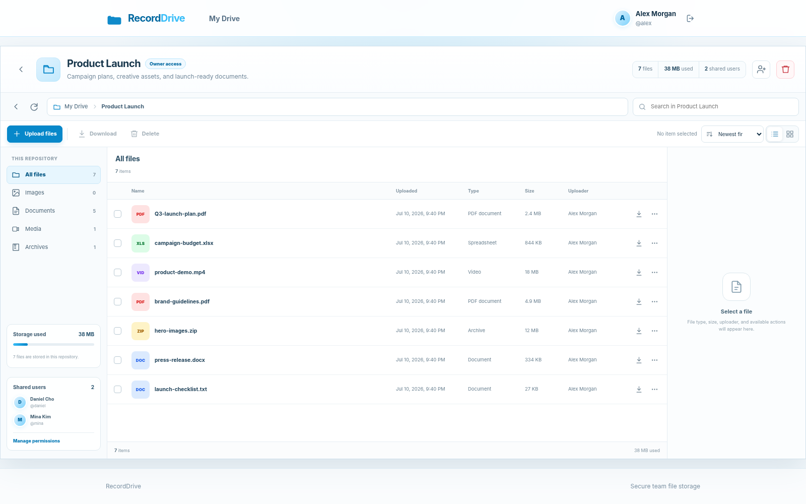

# RecordDrive

RecordDrive is a self-hosted Node.js file workspace with personal repositories, nested folders, and per-user repository permissions. Regular users create and own repositories, owners decide which actions another user may perform, and administrators retain full access to every repository.

Metadata, sessions, permission grants, and activity history are stored in SQLite. Uploaded file contents are stored on the local filesystem.

## Preview



## File previews

Select a file in the repository explorer and open the **Preview** tab in the right-hand information pane. Preview access follows the repository download permission.

- PDF files are displayed inline with the browser PDF viewer and include an open-in-new-tab fallback.
- XLSX files are rendered as a spreadsheet grid with worksheet tabs, merged cells, column widths, and common cell formatting. Preview processing is limited to 25 MB, and each worksheet preview shows at most the first 200 rows and 50 columns. Cell text, merge metadata, and total response text are also bounded.
- Unencrypted ZIP files are displayed as an expandable folder and file tree. Password-protected archives show a protected-file notice instead of their entries. A maximum of 2,500 ZIP entries is displayed, with limits on archive size, scanned entries, individual names, and total visible name data.
- 7z metadata preview is enabled by default and is implemented with a bounded JavaScript parser worker. It does not launch `7z.exe`, `7zz`, `7za`, PowerShell, or another external archive program. The worker reads only the signature, headers, and metadata streams needed for the listing; entry extraction APIs are disabled. Start Header and Next Header CRC values, offsets, sizes, coder graphs, entry counts, names, cumulative reads, memory, and runtime are bounded and validated.

### Pure-JavaScript 7z parser

RecordDrive pins `7z-iterator` and supplies a project-local security fork of `xz-compat`. The fork permanently disables native add-on loading and runtime package installation, and startup refuses unexpected parser versions or native, executable, DLL, or WebAssembly payloads in the decoder package. This keeps Windows npm and PM2 deployments independent of a machine-wide 7-Zip installation.

The parser runs in a disposable Node.js worker thread with a minimal environment and V8 memory limits. Password-protected headers or AES-encrypted stream metadata expose no entry names, entry count, or uncompressed-size totals. The server can still disable the feature explicitly with `SEVEN_ZIP_PREVIEW_ENABLED=false`. See [`docs/security/reports/2026-07-21-seven-zip-preview-review.md`](docs/security/reports/2026-07-21-seven-zip-preview-review.md) for the threat model, implementation boundaries, and residual risks.

## Repository folders

Repository users with upload permission can create nested folders and upload files directly into the current folder. Breadcrumb navigation, folder-scoped search, and direct-child listings keep each repository organized without changing the generated on-disk storage names. Existing file records remain in the repository root after the database migration.

Folder names are normalized and validated, sibling names are unique under SQLite's `NOCASE` comparison, nesting is limited to 32 levels, and deleting a folder requires delete permission. Folder deletion recursively removes its descendant folders and stored files.

## Access model

### Administrator

Administrators can:

- View every repository
- Create folders and upload or download files in every repository
- Delete files, folders, and repositories
- Manage repository permission grants
- Create and delete regular user accounts
- Review activity and storage metrics

Administrators cannot create repositories. Repository creation is reserved for regular users.

### Repository owner

A regular user becomes the owner of every repository they create. Owners automatically receive all repository permissions and can:

- View the repository and file metadata
- Create folders and upload or download files
- Delete files, folders, and the repository
- Grant, update, and revoke permissions for other regular users

Owner permissions are implicit and cannot be removed through a permission grant.

### Shared user

A repository owner or administrator can grant any combination of the following permissions:

| Permission | Effect |
| --- | --- |
| `View` | Open the repository and view file metadata |
| `Upload` | Create folders and upload files into the current folder |
| `Download` | Download stored file contents |
| `Delete` | Recursively delete folders and stored files; repository deletion remains limited to the owner and administrators |

Permissions are checked independently on every server request. A user with no `View` permission cannot discover or open another user's repository through the dashboard or a direct repository URL. A permission such as `Download` or `Upload` can technically be granted without `View`, but that user will not see the repository in the dashboard.

## Security behavior

- Access is denied by default unless the requester is an administrator, the repository owner, or has the required explicit permission.
- Repository access is checked on every view, folder creation, upload, download, file or folder deletion, repository deletion, and permission-management request. Repository deletion is restricted to the owner and administrators.
- Unauthorized repository requests return a generic not-found response to avoid exposing repository existence.
- HTTP `Host` authorities are parsed strictly before static files, body parsing, sessions, or authentication. Direct loopback use accepts only loopback host names and addresses; externally reachable deployments require an exact `ALLOWED_HOSTS` allowlist. Malformed, duplicate, untrusted, wildcard, encoded/confusable IP, and legacy numeric IPv4 authorities are rejected with HTTP 421 and no session cookie.
- Uploaded files receive generated storage names and are stored outside the public web directory.
- Stored files are opened with symbolic-link following disabled. Storage paths are canonicalized, symbolic-link ancestors are rejected during use, and repository/database paths reject symbolic links.
- File names shown to users are normalized and length-limited.
- File size, per-request file count, repository storage, total storage, and file-count limits are stored in SQLite. Administrators can update server-wide values from **Admin → Storage**, while repository owners and administrators can set per-repository file-size and storage overrides. New upload requests use changes immediately. Upload CSRF validation and quota checks occur before and during disk writes, and multipart field nesting is disabled.
- Production, every non-loopback listener, and every deployment with `TRUST_PROXY` enabled reject application requests that are not recognized as HTTPS before static files, body parsing, sessions, or authentication are reached. Those externally reachable modes also reject the example session secret, the example administrator password, and undersized encryption keys. Session cookies require HTTPS in those modes, and authenticated sessions have both rolling idle expiration and a server-enforced absolute lifetime. Server-side session identifiers are HMAC-protected and session payloads are encrypted with AES-256-GCM in SQLite; the encrypted payload is authenticated against its storage identifier so copied or modified rows are rejected. Existing plaintext session rows are encrypted during startup. CSRF protection, Helmet headers, bcrypt password hashing, and login/MFA rate limiting are enabled.
- TOTP secrets, saved TLS passphrases, and one-time recovery-code display data are protected with authenticated encryption.
- Administrator-created regular accounts receive a temporary password that must be replaced immediately after the first successful password and MFA sign-in. Until replacement, repository, file, settings, administration, and JSON endpoints are blocked. Password changes verify the current password, rotate the current session, revoke every other active session, and create an audit event.
- Administrators can enable native HTTPS, validate Posh-ACME certificate files, redirect HTTP requests, and reload renewed certificates without interrupting existing TLS connections. Corrupt or undecryptable saved TLS settings stop startup instead of silently disabling HTTPS.
- Startup resolves storage paths through existing filesystem ancestors and rejects filesystem roots, project parents, static files, source files, views, Git metadata, symbolic-link final components, and any database path inside the upload root.

## Security documentation

Security audit reports, proof-of-concept evidence, reproduction guidance, and the CycloneDX SBOM are centralized in [`docs/security`](docs/security/README.md).

## Two-step verification

Administrators and regular users can open **Settings → Security** to enable either or both of these methods:

- A TOTP authenticator app that produces six-digit codes every 30 seconds
- One or more FIDO2/WebAuthn passkeys stored in a platform authenticator, password manager, phone, or hardware security key

After the password is accepted, accounts with at least one method enabled must complete a second verification step. A registered TOTP code, any registered passkey, or an unused recovery key can complete the sign-in.

Security-sensitive changes require a recent password verification or sign-in. TOTP secrets are encrypted with AES-256-GCM before storage. Recovery keys are generated by the server, stored only as keyed hashes, and invalidated after one successful use. Passkey public keys, signature counters, transport hints, backup state, and last-use timestamps are stored in SQLite. Private passkey material never reaches RecordDrive.

The first successful TOTP or passkey registration creates eight recovery keys. Users can add more keys in batches, up to 32 active keys, or replace all existing keys. Plaintext recovery keys are displayed only once after creation and are encrypted while temporarily stored in the server-side session. Register multiple passkeys to avoid relying on a single device.

WebAuthn requires HTTPS except for trusted localhost development. In production and every externally reachable deployment, configure `WEBAUTHN_ORIGIN` as the exact trusted public origin, including a non-default port when applicable, and configure `WEBAUTHN_RP_ID` as the public host name without a scheme or port. RecordDrive does not derive these values from the request `Host` header in externally reachable modes. Changing these values makes previously registered passkeys unavailable until the original relying-party values are restored.

## Language settings

RecordDrive supports English, Japanese, Korean, French, Spanish, and Portuguese. When no saved preference exists, the application selects the first supported language from the browser's `Accept-Language` header and falls back to English. Signed-in users can open **Settings** to choose a language or return to automatic browser-language detection.

The saved preference is stored in an HTTP-only browser cookie and remains available after signing out. Application pages, validation messages, notifications, file-explorer interactions, and administrator interfaces use the selected language.

## Technology

- Node.js 22.23.0, 24.17.0, or 26.3.1 and newer within the supported release lines, with ES modules
- Express 5 and EJS
- SQLite through Node's built-in `node:sqlite` module
- Multer for multipart uploads
- ExcelJS for XLSX preview parsing, yauzl for ZIP directory inspection, and a pinned pure-JavaScript 7z header parser for metadata-only 7z previews
- `express-session` with a custom HMAC-indexed, AES-256-GCM-encrypted SQLite session store
- bcryptjs and Helmet
- otplib for RFC-compatible TOTP, QRCode for enrollment images, and SimpleWebAuthn Server for FIDO2 verification
- Node's built-in test runner with Supertest

## Getting started

```bash
cp .env.example .env
npm install
npm start
```

Open `http://localhost:3000` in a browser.

When administrator access is enabled, the application creates an administrator on the first run from the values in `.env`:

```env
ADMIN_ACCESS_DISABLED=false
ADMIN_USERNAME=admin
ADMIN_PASSWORD=ChangeMe123!
```

Set `ADMIN_ACCESS_DISABLED=true` (also accepts `on`, `yes`, or `1`) to disable administrator account creation, password login, MFA completion, existing administrator sessions, administrator-only routes, and implicit administrator repository privileges. Regular user login remains available. Existing administrator records are retained in SQLite so access can be restored later by changing the flag and restarting the service.

The example password and session secret are accepted only for direct loopback development without proxy trust. In that mode, incoming requests are also restricted to `localhost`, subdomains of `.localhost`, `127.0.0.0/8`, `::1`, and any exact entries in `ALLOWED_HOSTS`. RecordDrive refuses to start on a non-loopback listener or when `TRUST_PROXY` is enabled until `ALLOWED_HOSTS` contains at least one exact public host name or IP literal, `SESSION_SECRET` is unique and at least 32 UTF-8 bytes, and, when administrator access is enabled, `ADMIN_PASSWORD` is non-default and meets the password-length limits. The bootstrap password is used only when no administrator account exists.

## Available commands

| Command | Purpose |
| --- | --- |
| `npm start` | Start the web server |
| `npm run dev` | Start with Node's watch mode |
| `npm test` | Run integration and permission tests |
| `npm run check` | Check the server entry files for syntax errors |

## PM2 deployment

RecordDrive uses `src/server.js` as its dedicated executable entry point. Start PM2 with the included CommonJS ecosystem file so the working directory and ESM loading behavior remain consistent:

```bash
npm install -g pm2
pm2 start ecosystem.config.cjs
pm2 save
pm2 startup
```

Run the command printed by `pm2 startup` with the requested privileges. Useful operational commands are:

```bash
pm2 logs RecordDrive
pm2 restart ecosystem.config.cjs --update-env
pm2 stop ecosystem.config.cjs
```

The included ecosystem file uses the dedicated `src/server.js` service entry point. Direct legacy launches such as `pm2 start src/app.js --name RecordDrive` are also recognized, but the ecosystem file is preferred because it pins the working directory and shutdown behavior.

## Configuration

| Variable | Default | Description |
| --- | --- | --- |
| `PORT` | `3000` | Initial HTTP port; the administrator UI stores later changes in SQLite |
| `HTTP_HOST` | `127.0.0.1` in development/test; `0.0.0.0` otherwise | Initial HTTP bind address; any non-loopback value activates externally reachable deployment checks |
| `HTTPS_ENABLED` | `false` | Initial native HTTPS state before settings are saved in the administrator UI |
| `HTTP_TO_HTTPS_REDIRECT` | `true` | Initial HTTP-to-HTTPS redirect state |
| `HTTPS_PORT` | `3443` | Initial HTTPS port |
| `HTTPS_HOST` | `127.0.0.1` in development/test; `0.0.0.0` otherwise | Initial HTTPS bind address |
| `TLS_PUBLIC_HOSTNAME` | Empty | Public host name used for HTTP redirects |
| `TLS_CERT_MODE` | `pem` | Certificate input mode: `pem` or `pfx` |
| `TLS_CERT_DIRECTORY` | Empty | Posh-ACME order directory containing certificate files |
| `TLS_CERT_PATH` | Empty | PEM certificate chain path; defaults to `fullchain.cer` in the certificate directory |
| `TLS_KEY_PATH` | Empty | PEM private key path; defaults to `cert.key` in the certificate directory |
| `TLS_PFX_PATH` | Empty | PFX bundle path; defaults to `fullchain.pfx` in the certificate directory |
| `TLS_PASSPHRASE` | Empty | Initial private key or PFX passphrase |
| `TLS_AUTO_RELOAD` | `true` | Automatically reload renewed certificate files |
| `TLS_RELOAD_INTERVAL_MINUTES` | `5` | Certificate file change check interval |
| `NODE_ENV` | `development` | Enables production validation, secure transport enforcement, production error behavior, and static asset caching |
| `TRUST_PROXY` | `false` | Explicit Express proxy trust setting; enabling it activates externally reachable deployment checks even when the application binds only to loopback |
| `ALLOWED_HOSTS` | `localhost,127.0.0.1,::1` in `.env.example` | Comma-separated exact HTTP Host names or IP literals, without schemes, ports, or wildcards; mandatory for externally reachable deployments |
| `HTTP_REQUEST_TIMEOUT_MS` | `3600000` | Maximum time to receive a complete HTTP request body; the 1-hour default replaces Node.js's 5-minute default for large uploads, and `0` disables the limit |
| `HTTP_HEADERS_TIMEOUT_MS` | `60000` | Maximum time to receive complete HTTP headers; automatically clamped to `HTTP_REQUEST_TIMEOUT_MS` when that limit is enabled |
| `SEVEN_ZIP_PREVIEW_ENABLED` | `true` | Enables the bounded pure-JavaScript 7z metadata parser; set to `false` for an explicit policy override |
| `SEVEN_ZIP_PREVIEW_TIMEOUT_MS` | `60000` | Maximum runtime for the disposable JavaScript parser worker; accepted values are clamped to 1–300 seconds |
| `SEVEN_ZIP_PREVIEW_MAX_HEADER_MB` | `128` | Maximum expanded or compressed 7z metadata-header size in MiB; accepted values are clamped to 16–256 MiB and the worker memory budget scales with this bounded value |
| `SEVEN_ZIP_PREVIEW_MAX_SCANNED_ENTRIES` | `100000` | Maximum number of 7z entries inspected for metadata; accepted values are clamped to 10,000–250,000 |
| `SESSION_SECRET` | Example value | Secret used to sign session cookies and derive purpose-separated keys for session identifiers and encrypted session payloads |
| `ADMIN_ACCESS_DISABLED` | `false` | Disables administrator creation, login, sessions, privileges, and `/admin` routes when set to `true`, `on`, `yes`, or `1` |
| `ADMIN_USERNAME` | `admin` | Username for the first administrator when administrator access is enabled |
| `ADMIN_PASSWORD` | `ChangeMe123!` | Password for the first administrator |
| `ADMIN_DISPLAY_NAME` | `System Administrator` | Display name for the first administrator |
| `MFA_ENCRYPTION_KEY` | `SESSION_SECRET` | Stable key source used for TOTP, recovery-code, and saved TLS passphrase protection |
| `MFA_ISSUER` | `RecordDrive` | Issuer name displayed by authenticator applications |
| `WEBAUTHN_RP_NAME` | `RecordDrive` | Friendly relying-party name displayed during passkey registration |
| `WEBAUTHN_RP_ID` | Empty | Public host name used as the WebAuthn relying-party ID; required for production and externally reachable passkey use |
| `WEBAUTHN_ORIGIN` | Empty | Exact trusted public origin accepted for WebAuthn responses; required for production and externally reachable passkey use |
| `MAX_REPOSITORIES_PER_USER` | `1000` | Maximum repository records owned by one regular user |
| `MAX_TOTAL_REPOSITORIES` | `10000` | Maximum repository records across the service |
| `MAX_ACTIVITY_LOG_ENTRIES` | `100000` | Maximum retained audit-log records; the oldest records are removed in bounded batches |
| `MAX_SESSIONS_PER_USER` | `10` | Maximum active authenticated or pending-MFA sessions retained per account |
| `SESSION_IDLE_HOURS` | `12` | Rolling inactivity lifetime for a server-side session |
| `SESSION_ABSOLUTE_HOURS` | `168` | Maximum authenticated session lifetime regardless of activity |
| `DB_PATH` | `./data/recorddrive.db` | SQLite database path; it must remain outside `UPLOAD_ROOT` |
| `UPLOAD_ROOT` | `./data/uploads` | Initial uploaded-file storage directory; the administrator can override it in **Admin → Storage**, and it must not contain `DB_PATH` |

Upload and storage limits are not runtime environment settings. They are persisted in SQLite and edited through **Admin → Storage**. Legacy `MAX_FILE_SIZE_MB`, `MAX_FILES_PER_UPLOAD`, `MAX_REPOSITORY_STORAGE_MB`, `MAX_TOTAL_STORAGE_MB`, `MAX_REPOSITORY_FILES`, and `MAX_TOTAL_FILES` values are used only to seed missing database keys during an upgrade or first initialization; after the keys exist, the database is authoritative.

Every environment other than `development` and `test` uses production validation. Startup rejects a weak session secret, a weak or bcrypt-truncated bootstrap administrator password, and a separately configured MFA encryption key shorter than 32 UTF-8 bytes. The same secret-strength validation is applied in development or test whenever an active HTTP or HTTPS listener is not loopback-only or `TRUST_PROXY` is enabled. Externally reachable deployments also fail closed when `ALLOWED_HOSTS` is empty. Production and externally reachable deployments require requests to be recognized as HTTPS; use native TLS or a narrowly trusted TLS-terminating reverse proxy, preserve the intended public `Host` value, and list it exactly in `ALLOWED_HOSTS`.

## Large file uploads

RecordDrive streams multipart file data directly to the configured upload filesystem. Open **Admin → Storage** to set the default per-file limit, files per upload, repository storage quota, service-wide storage quota, repository file-count limit, and service-wide file-count limit. Enter `0` for an unlimited size or file-count quota where the UI permits it.

The native HTTP and HTTPS listeners allow up to one hour to receive a complete request by default (`HTTP_REQUEST_TIMEOUT_MS=3600000`). This avoids Node.js's built-in five-minute whole-request cutoff aborting a slow large upload after the browser has already handed off its request body. Increase the value for slower links or very large files. Use `0` only when a trusted reverse proxy enforces an appropriate request-body timeout, because an unlimited listener timeout weakens slow-request protection.

Repository owners and administrators can open **Repository Settings** to override the default per-file limit and repository storage quota for that repository. Leaving a repository field blank inherits the current administrator default; entering `0` makes that repository value unlimited. Service-wide storage and file-count limits always continue to apply. Saved changes are read from SQLite for the next upload request, so no application restart is required.

When RecordDrive is behind a reverse proxy, that proxy must also accept the request body and keep both client-body and upstream timeouts aligned with `HTTP_REQUEST_TIMEOUT_MS`. An NGINX example is provided at `docs/nginx-large-upload.conf.example`. Keep the application storage quotas enabled even when the proxy body-size check is disabled.


## Repository storage location

Open **Admin → Storage** to change the local filesystem root used for repository file contents. The administrator setting accepts an absolute path outside the RecordDrive project directory, including another local disk or a mounted filesystem. The saved path is stored in the SQLite `app_settings` table, takes precedence over `UPLOAD_ROOT` on later starts, and is applied immediately.

Two activation modes are available:

- **Move current repository data** requires an empty or nonexistent destination. RecordDrive validates the current storage tree, moves it to the new path, verifies cross-filesystem copies, and then saves the setting.
- **Use data already at the new path** is intended for data that an administrator copied or mounted separately. RecordDrive verifies that every file recorded in SQLite exists as a regular file under the selected root before switching.

The configured path cannot be a filesystem root, a parent of the RecordDrive project, a protected source/static/view/Git directory, a symbolic-link path, or a directory containing the SQLite database. The operating-system account running RecordDrive must have permission to create directories and read, write, rename, and delete files there.

The path field expands `~`, `$HOME`, `${VARIABLE}`, and `%VARIABLE%`. Relative paths are rejected in the administrator UI so the active location is unambiguous.

## Native HTTPS with Posh-ACME

Open **Admin → HTTPS / TLS** to configure the native Node.js HTTPS listener. Settings are validated and stored in the `app_settings` table inside the RecordDrive SQLite database. Environment variables provide only the initial values before the first UI save.

Posh-ACME order folders normally contain files suitable for either supported mode:

| Mode | Files | Recommended use |
| --- | --- | --- |
| PEM | `fullchain.cer` and `cert.key` | Recommended for direct Node.js use and certificate metadata display |
| PFX | `fullchain.pfx` | Single-file deployment when a PKCS#12 bundle is preferred; Posh-ACME uses `poshacme` as the default password unless overridden |

Typical certificate directory examples:

```text
C:\Users\Administrator\AppData\Local\Posh-ACME\LE_PROD\<order>\<domain>
/home/recorddrive/.config/Posh-ACME/LE_PROD/<order>/<domain>
```

The directory field expands `~`, `$HOME`, `${VARIABLE}`, and `%VARIABLE%`. When individual file fields are blank, RecordDrive looks for the default Posh-ACME names in that directory. Relative file names are resolved from the configured certificate directory.

To switch from HTTP to HTTPS:

1. Generate or renew the certificate with Posh-ACME.
2. Sign in as an administrator and open **HTTPS / TLS**.
3. Enable HTTPS, select PEM or PFX, enter the certificate directory, and configure the HTTP and HTTPS ports.
4. Enable HTTP redirection and enter the public host name, such as `drive.example.com`.
5. Save the settings and restart RecordDrive.

Listener, port, redirect, certificate-mode, and automatic reload schedule changes require a restart. When automatic reload is enabled, replacement certificate files at the configured paths are detected by modification time and loaded into the active TLS server without interrupting existing connections. The **Reload certificate now** action performs the same certificate-only reload on demand.

The optional passphrase is encrypted with AES-256-GCM before it is stored in SQLite. Protect the database, encryption key source, certificate files, and backups with operating-system access controls.

## Docker

Create `.env`, replace the example secrets, and choose either native HTTPS or a trusted TLS-terminating reverse proxy before starting the service:

```bash
cp .env.example .env
# Edit SESSION_SECRET, ADMIN_PASSWORD, and ALLOWED_HOSTS; configure native TLS or TRUST_PROXY for your proxy.
docker compose up --build -d
```

The Compose file explicitly forces `NODE_ENV=production` and in-container listeners on `0.0.0.0`, so values from `.env` cannot downgrade the container to development behavior. Host ports are published only on `127.0.0.1` by default, and Compose supplies a loopback-only `ALLOWED_HOSTS` default. Replace that value with the exact public host name before publishing through a reverse proxy or non-loopback interface. The application still requires HTTPS because the container listeners are non-loopback; terminate TLS in RecordDrive on port 3443 or send traffic through a reverse proxy whose exact topology is configured with `TRUST_PROXY`. Weak example secrets cause startup to fail.

The Compose configuration stores the database and uploaded files in the `recorddrive_data` volume. If the administrator selects different ports, update the Compose port mappings to match. Do not change host publication to `0.0.0.0` unless HTTPS is already working and the network exposure is intentional.

A container can use an administrator-selected host storage path only when that path is mounted into the container. Add a writable bind mount or volume, then enter the container path in **Admin → Storage**, for example:

```yaml
services:
  recorddrive:
    volumes:
      - recorddrive_data:/app/data
      - /host/path/to/repository-data:/repository-data
```

Then set the repository local filesystem path to `/repository-data`.

A container cannot read a Posh-ACME directory from the host unless it is mounted. Add a read-only bind mount and use the container path in the administrator UI, for example:

```yaml
services:
  recorddrive:
    volumes:
      - recorddrive_data:/app/data
      - /host/path/to/posh-acme-order:/certificates:ro
```

Then set the certificate directory to `/certificates`.

To inspect service health through native HTTPS, use the configured certificate trust settings, for example:

```bash
curl https://localhost:3443/health
```

For a reverse-proxy deployment, query the proxy's public HTTPS URL instead. A healthy instance returns:

```json
{
  "status": "ok",
  "service": "RecordDrive",
  "transport": "https"
}
```

## Project layout

```text
RecordDrive/
├── src/
│   ├── app.js
│   ├── config.js
│   ├── database.js
│   ├── i18n.js
│   ├── i18n-extended.js
│   ├── i18n-security.js
│   ├── i18n-preview.js
│   ├── file-preview.js
│   ├── security-service.js
│   ├── network-server.js
│   ├── tls-settings.js
│   ├── repository-access.js
│   ├── repository-service.js
│   ├── session-store.js
│   ├── storage-path-security.js
│   ├── upload-storage.js
│   ├── middleware/
│   └── routes/
├── views/
├── public/
├── data/
├── test/
├── Dockerfile
└── docker-compose.yml
```

## Deployment notes

Use either the native HTTPS listener or a trusted HTTPS reverse proxy with `NODE_ENV=production`. Every externally reachable deployment must set `ALLOWED_HOSTS` to the exact public host names or IP literals accepted from clients; schemes, ports, wildcard suffixes, and forwarded-host fallback are intentionally unsupported. The reverse proxy must overwrite the upstream `Host` header with one of those values. Host validation runs before static serving, body parsing, sessions, and authentication. The application then returns HTTP 426 for every request that Express does not recognize as HTTPS in production, on any non-loopback listener, or whenever `TRUST_PROXY` is enabled. Authentication cookies are always marked `Secure` in those modes. Enabling proxy trust also forces strong-secret and non-default administrator-password validation, even when the application listener itself is loopback-only. Proxy trust is disabled by default; set `TRUST_PROXY` only when the exact proxy topology is known, because forwarded client and protocol headers are otherwise attacker-controlled. Universal trust values such as `true` are rejected. Do not expose the application listener directly when it is configured to trust a reverse proxy. Keep secrets outside source control, protect the persistent data volume and certificate files with filesystem permissions, and maintain regular backups.

Browser upload forms already place `_csrf` before file parts. Custom multipart clients must do the same or send the token in the `X-CSRF-Token` header so the request can be authenticated before any file bytes are opened on disk.

This build targets a single application instance with local SQLite and disk storage. Multi-instance deployments require shared sessions, a networked database, and shared object storage. Malware scanning, public links, trash recovery, and nested folders are outside the current scope. Storage quotas are enforced from database-tracked file sizes and should be paired with operating-system or volume quotas for defense in depth.
